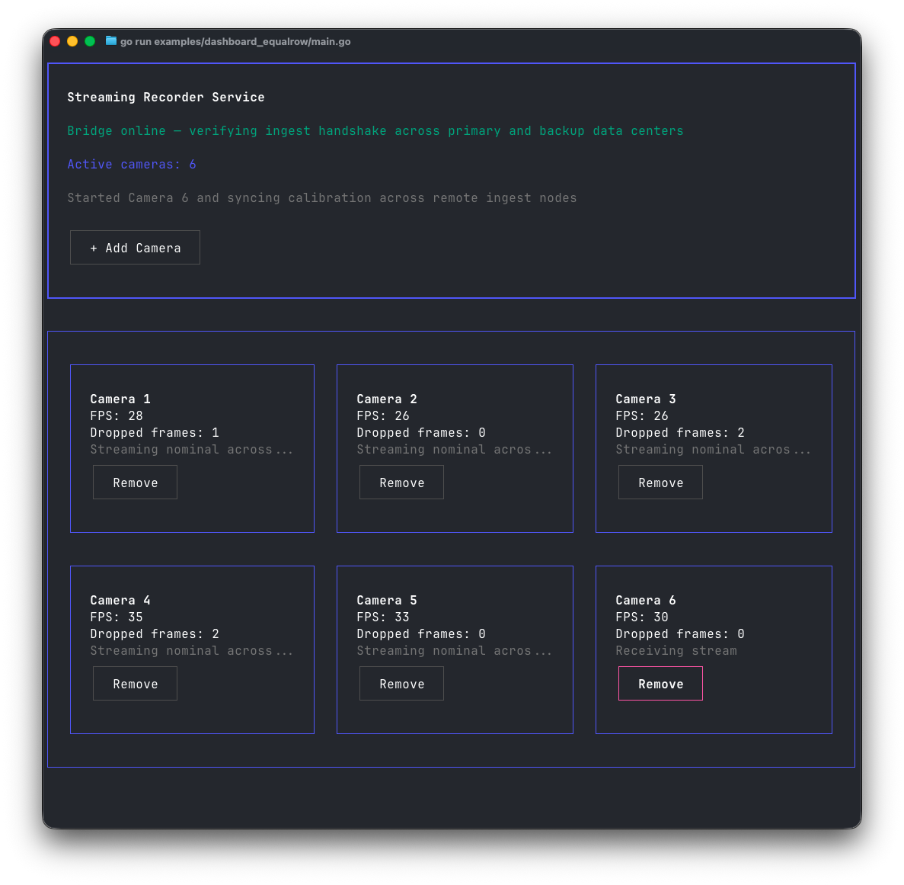
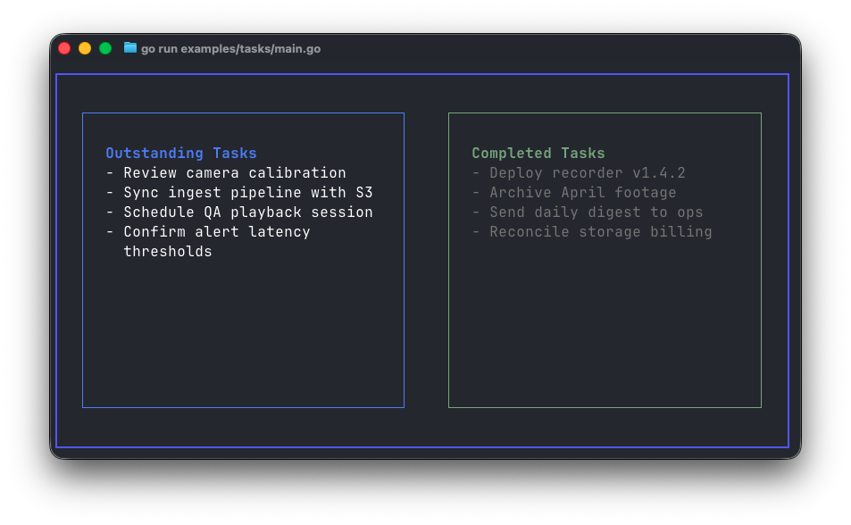
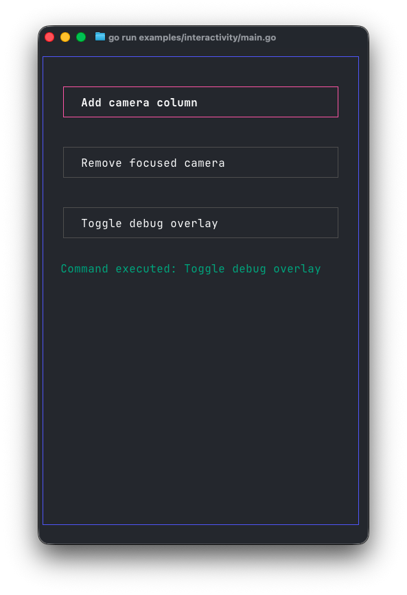

# bubbleviews

Pure data render models for Bubble Tea + Lip Gloss. Define your interface as Go
structs, hand it to a renderer, and let Bubble Tea do nothing more than ferry
events and repaint strings.

- **Render model first.** Compose Box, Flex, and Text nodes defined in `view.go`.
- **Renderer second.** `render.Render` walks the model and emits Lip Gloss markup.
- **Bubble Tea last.** The Bubble Tea program simply caches the latest render model.

<div align="center">
  
</div>

<p align="center">
<a href="examples/hello"><code>examples/hello</code></a> ·
<a href="#render-model">Render Model</a> ·
<a href="#examples">Examples</a> ·
<a href="#why-bubbleviews">Why bubbleviews?</a>
</p>

---

## Quick start

```sh
git clone git@github.com:sprucelabsai-community/bubbleviews.git
cd bubbleviews
go run ./examples/hello
```

Prefer VS Code? Use the built-in launch config **Run: Hello World Example** and
the demo will start in the integrated terminal (`q`, `esc`, or `ctrl+c` to exit).

---

## Render model

All layout intent lives in a set of plain structs:

```go
view := bubbleviews.View{
	Size: bubbleviews.Size{Width: width, Height: height},
	Children: []bubbleviews.Node{
		bubbleviews.BoxNode{
			Style: bubbleviews.BoxStyle{
				Border:      bubbleviews.BorderThick,
				BorderColor: bubbleviews.Color("63"),
				Padding:     bubbleviews.Padding{Top: 1, Bottom: 1, Left: 2, Right: 2},
				FillWidth:   true,
				FillHeight:  true,
				HAlign:      bubbleviews.AlignCenter,
				VAlign:      bubbleviews.AlignCenter,
			},
			Content: bubbleviews.View{
				Children: []bubbleviews.Node{
					bubbleviews.BoxNode{
						Style: bubbleviews.BoxStyle{
							Border:      bubbleviews.BorderThin,
							BorderColor: bubbleviews.Color("205"),
							Padding:     bubbleviews.Padding{Left: 2, Right: 2},
						},
						Content: bubbleviews.View{
							Children: []bubbleviews.Node{
								bubbleviews.TextNode{Value: "Hello World"},
							},
						},
					},
				},
			},
		},
	},
}
```

Renderers remain pure, translating these intent structs into terminal output.
There are no Bubble Tea imports inside the render model, and the renderer never
mutates the model it receives.

---

## Examples

- [`examples/hello`](examples/hello): full-screen box with a centered “Hello World” button.
- [`examples/tasks`](examples/tasks): split-pane dashboard showing outstanding and completed checklists side-by-side.
- [`examples/interactivity`](examples/interactivity): keyboard-driven command list showcasing interactive focus/selection.
- [`examples/dashboard`](examples/dashboard): recorder dashboard mock with dynamic camera columns and status metrics.
- [`examples/ascii_art`](examples/ascii_art): centered ASCII banner using the `ASCIIArtNode` helper.
- [`examples/even_rows`](examples/even_rows): demonstrates the `EqualWidthRow` helper and column-width percentages with truncated copy.
- [`examples/dashboard_equalrow`](examples/dashboard_equalrow): recorder dashboard remix that chunks camera cards into even-width rows with clipped text.

<table>
  <tr>
    <td width="55%">
      
    </td>
    <td width="45%" valign="top">
      
      <ul>
        <li><strong>Tasks view:</strong> Two-column layout with shared borders and bullet helpers.</li>
        <li><strong>Interactive view:</strong> Focused commands with keyboard affordances, built entirely from `FlexNode`s.</li>
      </ul>
    </td>
  </tr>
</table>

We’re vibe-coding this project—examples are our tests.

Every new example ships with a matching VS Code launch configuration, so you can pick any entry from the **Run and Debug** panel and see the render model in action immediately.

---

## Why bubbleviews?

- **Pure intent, no framework glue.** Your view tree is just Go structs; Bubble Tea and Lip Gloss come in only when it’s time to render or handle IO. That keeps layout logic portable and dead-simple to test (copy/paste a struct, compare strings).
- **Render once, reuse everywhere.** Because the render model is a plain data description, you can unit-test it, serialize it, or feed it to alternative renderers later (imagine HTML or image outputs) without touching app logic.
- **Composable building blocks.** Helpers like `EqualWidthRow`, `ListView`, and `EvenRowGrid` are sugar that emit the same three primitives (`BoxNode`, `FlexNode`, `TextNode`). You gain higher-level ergonomics without bloating the renderer with special cases.
- **Fast iteration via examples.** Each feature lands as a runnable example plus launch config for vscode. Run `go run ./examples/<name>` (or select the launch config) and you’re staring at the exact render output you’ll ship—zero guesswork.

---

## License

MIT © Spruce Labs
